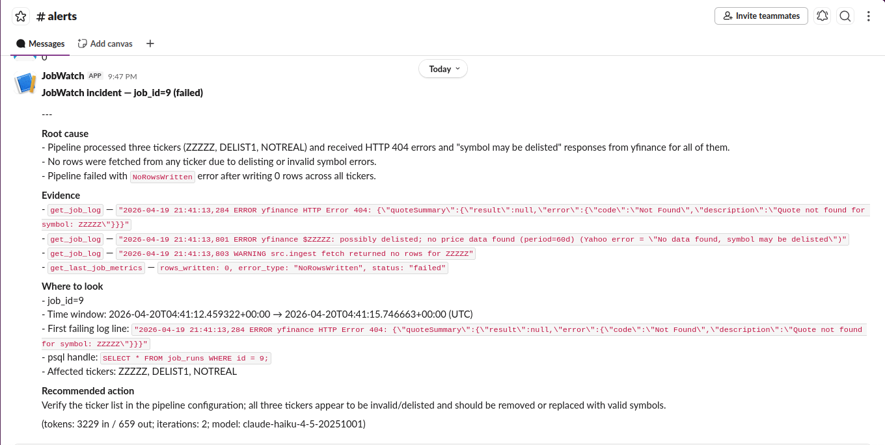

# JobWatch — an AI-Ops on-caller for a daily data pipeline


JobWatch is an **AI-powered on-call assistant for a financial data pipeline**. Its core idea is simple: instead of just recording that a pipeline failed, it automatically investigates the failure using an AI (Claude/Anthropic) and produces a plain-English incident report — almost like having a junior SRE who wakes up when something breaks, looks at the evidence, and writes up what happened.

---

## What does the pipeline do?

There is a scheduled data pipeline that:
- **Fetches stock market data** (OHLCV — Open, High, Low, Close, Volume) for a configured list of tickers from Yahoo Finance.
- **Transforms it** — calculating rolling averages and flagging statistical anomalies.
- **Stores it** in a PostgreSQL database.
- Every time it runs, it **records metadata about that run** — how many rows were written, whether it succeeded or failed, and a snippet of any error logs.

---

## What does the monitor do?

A separate **monitor** process keeps an eye on those run records. Every few seconds it checks:
- Did any run **fail**?
- Did any run write **fewer rows than expected** (a silent failure)?

When either of those happens, it triggers the diagnosis process.

---

## What does the AI diagnosis do?

When a bad run is detected, JobWatch:
1. **Calls Claude (Anthropic's AI)** with a set of tools that can query the database — looking at recent data rows, the job's error log, and pipeline metrics.
2. Claude **iteratively uses those tools** (up to 5 rounds) to gather evidence, like a detective piecing together what went wrong.
3. Claude then produces a **structured incident report** covering: root cause, evidence found, where to look in the code, and recommended action.

---

## How do alerts get delivered?

A short incident report with exactly these three sections, in this order is delivered on Slack:

1. **Root cause** — one paragraph. Quote concrete evidence from tool calls.
2. **Evidence** — bullet list. Each bullet names the tool used and the reference log file with timestamp.
3. **Recommended action** — one line, possible fixes and files to check.
---

## What else is included?

- An **MCP (Model Context Protocol) server** is also exposed, which allows external AI tools (like the MCP Inspector) to connect and use the same database-querying tools interactively.
Samples of the MCP server in action are included in [`docs/imgs/`](docs/imgs)
- **Prometheus metrics** are emitted so you could hook up a Grafana dashboard in the future.
- **Fault injection scripts and tests** are included to deliberately break the pipeline and verify that the monitoring and diagnosis system catches it correctly.


**Example of Slack alert:**



---

## The prompt

```
You are an on-call reliability engineer for a daily financial data pipeline that ingests
OHLCV bars from yfinance into Postgres.

A job just failed or produced suspiciously few rows. Use the tools to investigate: the
latest job_runs row (including its captured log_snippet), compact job metrics, and recent
OHLCV rows per ticker when relevant.

Produce a short incident report with exactly these three sections, in this order:

**Root cause** — one paragraph. Quote concrete evidence from tool calls.
**Evidence** — bullet list. Each bullet names the tool used and the key fact it surfaced.
**Recommended action** — one line, imperative.

Do not speculate beyond what the tools returned. If the evidence is insufficient to
determine a cause, say so plainly in the Root cause section.
```

---

## Quickstart

```bash
cp .env.example .env
# edit .env: set ANTHROPIC_API_KEY (required) and optionally SLACK_WEBHOOK_URL

make up                    # start postgres on :5434, schema auto-loaded
make sync                  # uv sync the Python env
make run-pipeline          # one ingest run for the configured tickers
make monitor               # start the monitor (long-running)

# In another terminal, trigger a failure:
make break-ticker          # .env TICKERS=ZZZZZ,DELIST1,NOTREAL
make run-pipeline          # produces a failed job_runs row
# -> monitor picks it up within 5s, diagnose fires, Slack + incidents.log updated

make restore-ticker        # revert .env
make down
```

Run the tests:

```bash
make test                  # pytest — transform correctness + MCP fault injection
```

Run the concurrency benchmark:

```bash
make load-test             # writes docs/concurrency_findings.md + PNG
```

---

## Architecture

See [`docs/architecture.md`](docs/architecture.md) for the Mermaid diagram.

Four moving parts:

- **pipeline** — one-shot ingest; writes `ohlcv` rows and a `job_runs` audit row.
- **monitor** — long-running poll over `job_runs`; triggers diagnosis on failures or `rows_written < threshold`.
- **mcp_server** — stdio MCP server exposing three tools (`query_recent_rows`, `get_job_log`, `get_last_job_metrics`) + Prometheus on `:9100`.
- **postgres** — one container, host port `5434`, schema in `sql/schema.sql`.

---

## Cost

~$0.005 per incident at Haiku pricing, based on the two captured scenarios (2–3 tool-use iterations, ~2.5K input + ~400 output tokens). Switching to Sonnet for polish would roughly 10× it and is worth it only for demos.

---

## Future Enhancements

- **Monitor checkpoint persistence** — Store `last_seen_id` in a durable store so the monitor resumes exactly where it left off after any restart or downtime.
- **MCP server authentication** — Add token-based authentication to the MCP server, enabling secure network deployments beyond local communication
- **Retry with backoff on yfinance fetches** — Transient fetch failures for delisted or temporarily unavailable tickers will be retried with exponential backoff before being logged and skipped, reducing false-positive failure reports.
- **MCP liveness alerting** — Real-time notifications for MCP server crashes or LLM API timeouts, ensuring the engineers are alerted instantly if the system stops responding
