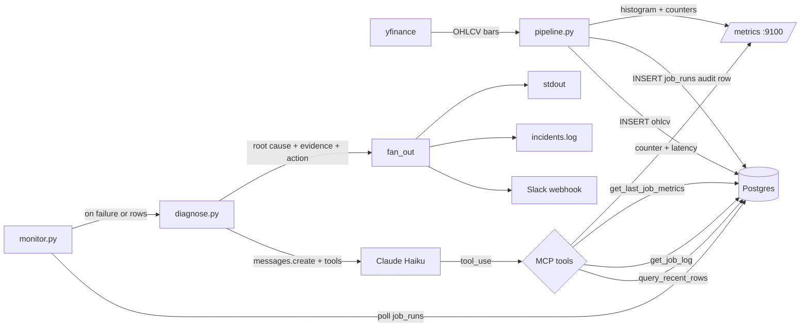

# Architecture

## Processes

- **pipeline** (`python -m src.pipeline`) — one-shot; fetches OHLCV for the configured tickers, writes to `ohlcv`, records a row in `job_runs`.
- **monitor** (`python -m src.monitor`) — long-running; polls `job_runs` every 5s for new failures, fires diagnose on each.
- **mcp_server** (`python -m src.mcp_server.server`) — stdio MCP server exposing the three tools used by diagnose (also exposes Prometheus on `:9100`).
- **postgres** — one container, host port `5434`, initialized with `sql/schema.sql`.

## Tables

- `ohlcv(ticker, ts, open, high, low, close, volume, rolling_avg_20, anomaly)` — PK `(ticker, ts)`, idempotent via `ON CONFLICT`.
- `job_runs(id, started_at, finished_at, status, rows_written, error_type, error_message, log_snippet)` — one row per pipeline invocation; `log_snippet` captures the last ~2KB of stderr from the run for the LLM to read.

## Diagnosis loop

Anthropic tool-use, max 5 iterations. Tools are the three MCP tools, called in-process (same Python module) — the MCP server is the *shape* we expose, but diagnose doesn't go through stdio to itself.
