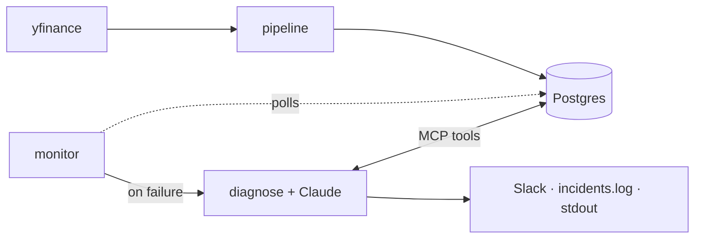

# Architecture

Six moving parts, one direction of flow: `pipeline` writes to `Postgres`; `monitor` polls; on a bad `job_runs` row, `diagnose` runs the Claude tool-use loop against the MCP tools (which read `Postgres`) and fans the result out to Slack, a local log, and stdout.

## Processes

- **pipeline** (`python -m src.pipeline`) — one-shot; fetches OHLCV for the configured tickers, writes to `ohlcv`, records a row in `job_runs`.
- **monitor** (`python -m src.monitor`) — long-running; polls `job_runs` every 5s for new failures, fires diagnose on each.
- **mcp_server** (`python -m src.mcp_server.server`) — stdio MCP server exposing the three tools used by diagnose (also exposes Prometheus on `:9100`).
- **postgres** — one container, host port `5434`, initialized with `sql/schema.sql`.

## Tables

- `ohlcv(ticker, ts, open, high, low, close, volume, rolling_avg_20, anomaly)` — PK `(ticker, ts)`, idempotent via `ON CONFLICT`.
- `job_runs(id, started_at, finished_at, status, rows_written, error_type, error_message, log_snippet)` — one row per pipeline invocation; `log_snippet` captures the last ~2KB of stderr from the run for the LLM to read.

## MCP tool shape

All three tools return `dict[str, Any]` and never raise — the `_instrumented` decorator guarantees `{"error", "error_type"}` on failure. This lets the diagnose loop treat MCP failures as data the LLM reasons over, not as crashes that swallow the alert.
