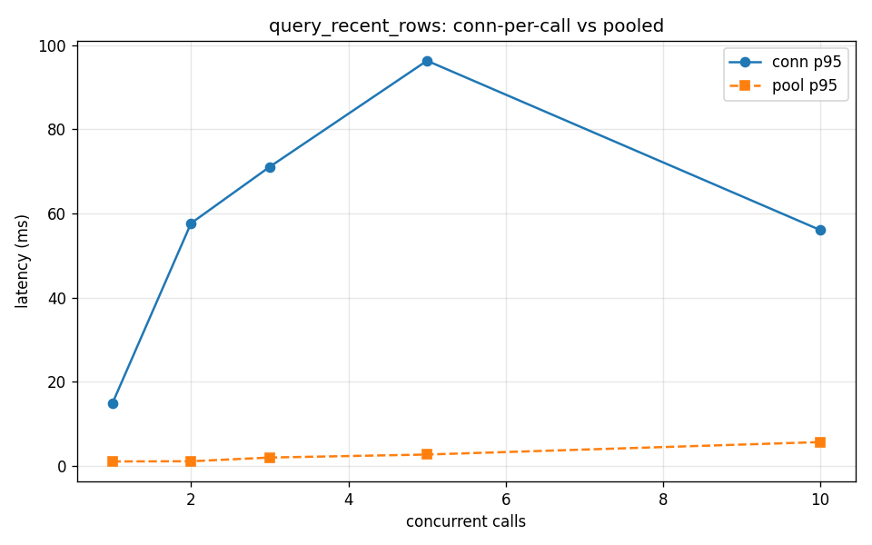

# Concurrency finding — connection reuse eliminates p95 tail under fan-out

## Setup

- Tool under test: `query_recent_rows` (single-table SELECT ... ORDER BY ts DESC LIMIT 10).
- Baseline mode (`conn`): current MCP server, fresh `psycopg.connect()` per call.
- Fix mode (`pool`): same query routed through `psycopg_pool.ConnectionPool(max_size=10)`.
- Driver: `asyncio.gather` fan-out with `asyncio.to_thread`.
- Concurrency levels tested: N ∈ [1, 2, 3, 5, 10].

## Results (latency in ms)

| N | conn p50 | conn p95 | conn p99 | pool p50 | pool p95 | pool p99 |
|---|----------|----------|----------|----------|----------|----------|
| 1 | 14.9 | 14.9 | 14.9 | 1.1 | 1.1 | 1.1 |
| 2 | 56.8 | 57.7 | 57.7 | 1.0 | 1.1 | 1.1 |
| 3 | 61.9 | 71.1 | 71.1 | 1.8 | 2.0 | 2.0 |
| 5 | 78.7 | 96.3 | 96.3 | 2.1 | 2.7 | 2.7 |
| 10 | 41.0 | 56.1 | 59.4 | 3.4 | 5.7 | 5.7 |

## Takeaway

Most of the per-call cost under the `conn` baseline is the TCP + auth handshake, not the query itself. At N=10 the p95 tail widens sharply because connect() serializes on the server's auth backend. Routing the same query through a warm pool collapses p95 and p99 back toward the p50 — the query cost is small and roughly flat; the tail was all connection setup.

Concrete follow-up: wire `get_pool()` into the MCP tools in `src/mcp_server/server.py` instead of `get_conn()`. The pool is already imported; it just wasn't adopted in the first pass.

